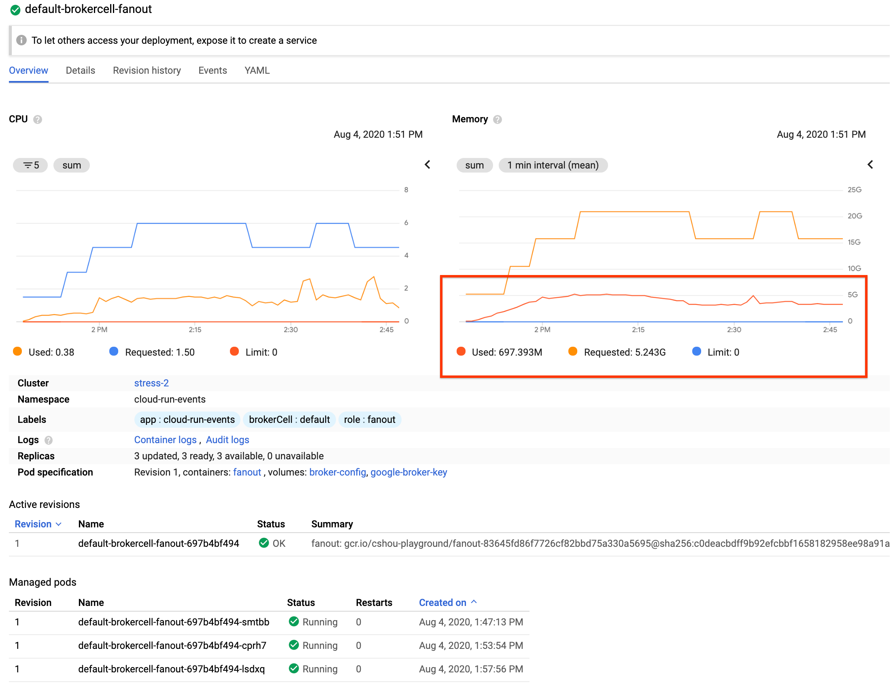

# Manual Broker Performance/Stress Tests

## When?

At the moment the continuous [performance tests]() we run with [Mako]() doesn't
provide the following features:

- The ability to configure test events. E.g. Event payload size.
- The ability to configure different trigger receiver behaviors. E.g. Delay
  receivers responses.
- The ability to keep the [profile](./profiling.md) data for analysis.
- The ability to keep the system resource usage history for analysis.

It's time to consider doing manual performance/stress tests when you need the
abilities above for analysis in depth.

## How?

### Prepare a cluster

Create a GKE cluster.

```
gcloud beta container clusters create $CLUSTER_NAME --addons=HttpLoadBalancing,HorizontalPodAutoscaling,CloudRun --machine-type=n1-standard-4 --enable-autoscaling --min-nodes=10 --max-nodes=15 --no-issue-client-certificate --num-nodes=5 --image-type=cos --enable-stackdriver-kubernetes --scopes=cloud-platform,logging-write,monitoring-write,pubsub --zone $CLUSTER_ZONE --release-channel=regular
```

Connect to your cluster.

```
gcloud container clusters get-credentials $CLUSTER_NAME  --zone $CLUSTER_ZONE
```

> **Tip**: Depending on the testing load, you might want to adjust the cluster
> size accordingly. Based on the past tests, usually 10 n1-standard-4 nodes are
> enough.

### (Optional) Enable profiling

Make a local branch of `knative-gcp`.

```
git checkout -b local/stress
```

Enable [GCP profiler](./profiling.md) by adding the following env vars to the
deployment spec of all broker components.

```
			{
				Name:  "GCP_PROFILER",
				Value: "true",
			},
			{
				Name:  "GCP_PROFILER_SERVICE_VERSION",
				Value: "test-0.1",
			},
```

https://github.com/google/knative-gcp/blob/e925d61ab5aff3e033d6cb2c505c7ab504c2b9b3/pkg/reconciler/brokercell/resources/deployments.go#L193-L223

> **Tip**: Always set `GCP_PROFILER_SERVICE_VERSION` to a unique value when
> running a different test scenario. It would allow you to easily tell a profile
> belongs to which test scenario.

### Set up the cluster

Follow the steps in the [installation guide](../install/install-knative-gcp.md)
to install Knative-GCP from your local branch.

> **Note**: If your cluster already has CloudRun addon enabled (like specified
> in "prepare a cluster" section), then you can skip installing the Knative
> Serving.

During testing, potentially you need to change some Knative-GCP code (including
update `GCP_PROFILER_SERVICE_VERSION`). After such changes, re-apply the
changes.

```
ko apply -f ./config
```

### Prepare test scenario(s)

Checkout [ce-test-actor](https://github.com/yolocs/ce-test-actor).

```
mkdir -p $GOPATH/src/github.com/yolocs && cd $GOPATH/src/github.com/yolocs
git clone git@github.com:yolocs/ce-test-actor.git
cd ce-test-actor
```

There are some existing test scenarios under
[scenarios dir](https://github.com/yolocs/ce-test-actor/tree/master/scenarios).
Apply the scenario you want to run, E.g.

```
ko apply -f ./scenarios/health
```

#### Generate your own scenarios

`ce-test-actor` provides a `br-gen` cmd tool that helps generating yamls for
your desired scenarios. E.g.

```
go run ./cmd/br-gen/main.go -output=/home/stress -ns=test-ns -count=80 -fail=2 -slow=2s -interval=1s -size=200000 -actors=10
```

The command above will generate yamls under `/home/stress`. The yamls include

- `00-namespace.yaml` that creates test namespace `test-ns`
- `01-broker.yaml` that creates a test broker
- `02-triggers.yaml` that creates `80` triggers and corresponding receivers
  where each has `2%` error rate and successful requests will be delayed for
  `2s` before reply
- `03-seeder.yaml` that creates an event seeder deployment (`10` replicas) where
  each pod will send an test event with payload size `200000` bytes every `1s`

Explore other `br-gen` flags
[here](https://github.com/yolocs/ce-test-actor/blob/master/cmd/br-gen/main.go).

In addition, you can manually edit generated yamls for any further customization
you need.

### Run the test scenario(s)

Assume your scenario's yamls are at `/home/stress`. Then simply apply them.

```
ko apply -f /home/stress
```

### Look at data

The GCP profiler data is located at https://console.cloud.google.com/profiler
(select your project when prompted). If you set `GCP_PROFILER_SERVICE_VERSION`
earlier, you should be able to filter profiles by a specific version.


To understand component resource usage, go to
https://console.cloud.google.com/kubernetes/workload and check out the resource
usage of `default-brokercell-ingress`, `default-brokercell-fanout` and
`default-brokercell-retry`.



Sometimes it's also helpful to look at metrics at
https://console.cloud.google.com/monitoring/metrics-explorer. Search for "Cloud
Run for Anthos Broker" and "Cloud Run for Anthos Trigger" metrics.


